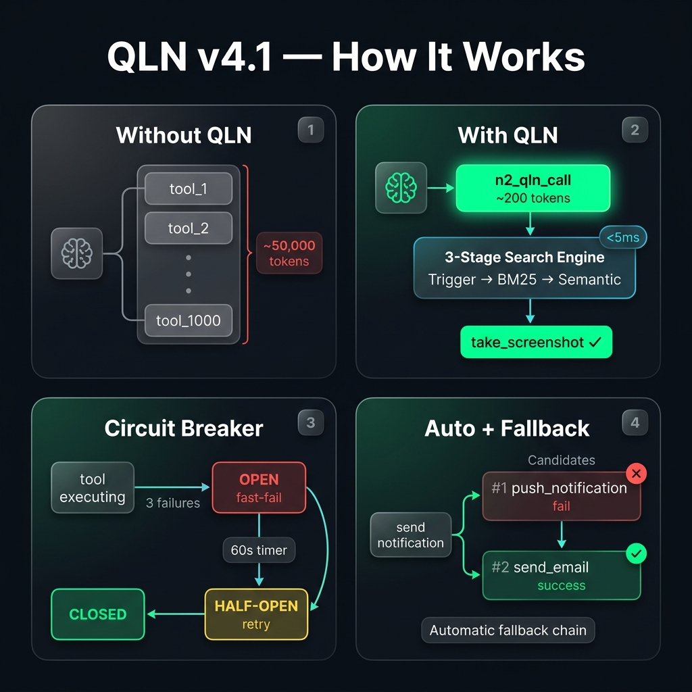

🇺🇸 [English](README.md)

# n2-qln

[](https://www.npmjs.com/package/n2-qln) [](LICENSE) [](https://nodejs.org) [](https://www.npmjs.com/package/n2-qln)

**QLN** = **Q**uery **L**ayer **N**etwork — AI와 도구 사이에 위치하는 시맨틱 도구 라우터.

> **1,000개 이상의 도구를 1개의 MCP 도구로 라우팅합니다.** AI는 라우터만 봅니다 — 1,000개 전체가 아닙니다.



## 목차

- [왜 QLN인가](#왜-qln인가)
- [v4.1 주요 변경사항](#v41-주요-변경사항)
- [빠른 시작](#빠른-시작)
- [작동 방식](#작동-방식)
- [API 레퍼런스](#api-레퍼런스)
- [MCP 자동 디스커버리](#mcp-자동-디스커버리)
- [Provider 매니페스트](#provider-매니페스트)
- [설정](#설정)
- [프로젝트 구조](#프로젝트-구조)
- [FAQ](#faq)
- [기여하기](#기여하기)

## 왜 QLN인가

MCP 도구를 등록할 때마다 컨텍스트 토큰을 소모합니다. 10개? 괜찮습니다. 100개? 느려집니다. **1,000개? 불가능합니다** — 대화 시작 전에 컨텍스트가 가득 찹니다.

QLN이 해결합니다:

1. 모든 도구를 QLN의 SQLite 엔진에 인덱싱
2. AI는 **도구 1개**만 봅니다: `n2_qln_call` (~200 토큰)
3. AI가 검색 → 최적 매칭 → 자동 폴백과 함께 실행

**결과: ~50,000 토큰 대신 ~200 토큰. 99.6% 절감.**

## 기능

| 기능 | 설명 |
|------|------|
| **1 도구 = 1,000 도구** | AI는 `n2_qln_call` (~200 토큰)만 보고, QLN이 올바른 도구로 라우팅 |
| **5ms 이하 검색** | 3단계 엔진: 트리거 매칭 → BM25 키워드 → 시맨틱 벡터 |
| **Auto 모드** | 검색 + 실행 원샷. 신뢰도 게이팅 + 폴백 체인 |
| **서킷 브레이커** | 실패하는 도구 자동 비활성화, 타임아웃 후 자동 복구 |
| **MCP 자동 디스커버리** | 외부 MCP 서버 스캔 → 도구 자동 인덱싱 |
| **부스트 키워드** | 2× BM25 가중치 적용 검색어로 정밀 검색 |
| **자동 학습 랭킹** | 사용 횟수 + 성공률이 점수에 반영 |
| **소스 가중치** | 출처별 도구 우선순위 (mcp > plugin > local) |
| **핫 리로드** | `providers/` 매니페스트 런타임 수정 → 자동 재인덱싱 |
| **벌크 인젝트** | 한 번의 호출로 수백 개 도구 등록 |
| **강제 검증** | `verb_target` 네이밍, 최소 설명 길이, 카테고리 제약 |
| **시맨틱 검색** | 선택적 Ollama 임베딩으로 자연어 매칭 |
| **네이티브 의존성 제로** | [sql.js](https://github.com/sql-js/sql.js) WASM 기반 — `npm install`이면 끝 |
| **이중 실행** | 로컬 함수 핸들러 또는 HTTP 프록시 — 혼합 가능 |
| **TypeScript strict** | v4.0부터 완전 strict 모드 코드베이스 |

## v4.1 주요 변경사항

### 🔍 MCP 자동 디스커버리

연결된 MCP 서버를 스캔하고 도구를 자동 인덱싱 — QLN이 **범용 MCP 허브**가 됩니다.

```javascript
n2_qln_call({
  action: "discover",
  servers: [
    { name: "my-server", command: "node", args: ["server.js"] }
  ]
})
// → my-server에서 47개 도구 발견 (320ms)
```

### ⚡ 서킷 브레이커

3회 연속 실패 시 도구 자동 비활성화. 60초 후 복구 시도. 연쇄 장애 방지.

```
closed → 3회 실패 → open (즉시 거부) → 60초 → half-open (재시도) → 성공 → closed
```

### 🔄 폴백 체인

`auto` 모드에서 최대 3개 후보를 순차 시도. 1순위가 실패하면 자동으로 다음 후보 실행.

```
auto "알림 보내기" → push_notification 시도 ❌ → send_email 시도 ✅
```

### 🎯 부스트 키워드

`boostKeywords` 필드로 검색 최적화. BM25 랭킹에서 2배 가중치 적용.

```json
{
  "name": "send_email",
  "description": "이메일을 수신자에게 전송",
  "boostKeywords": "smtp outbound notification mail"
}
```

### v4.1.1 — 품질 패치

| 변경 | 상세 |
|------|------|
| **배치 Persist** | `registerBatch()`와 `precomputeEmbeddings()`가 도구별이 아닌 1회만 디스크에 씀. 1,000개 도구 = 1번 쓰기. |
| **임베딩 TTL** | `isAvailable()`이 영구 캐시 대신 5분마다 Ollama 재확인. 늦게 시작된 Ollama도 감지. |
| **Strict TypeScript** | `noUnusedLocals` + `noUnusedParameters` 활성화. 죽은 코드 제로. |
| **레거시 정리** | v4 이전 JavaScript 1,895줄 삭제. 순수 TypeScript 코드베이스. |
| **국제화** | 검증기 에러 메시지 전면 영문화 (OSS 국제 사용자 대응). |

---

## 빠른 시작

```bash
npm install n2-qln
```

**요구사항:** Node.js ≥ 18

### MCP 클라이언트 연결

<details>
<summary><strong>Claude Desktop</strong></summary>

`claude_desktop_config.json` 편집:

```json
{
  "mcpServers": {
    "n2-qln": {
      "command": "npx",
      "args": ["-y", "n2-qln"]
    }
  }
}
```
</details>

<details>
<summary><strong>Cursor</strong></summary>

**Settings → MCP Servers → Add Server**:

```json
{
  "name": "n2-qln",
  "command": "npx",
  "args": ["-y", "n2-qln"]
}
```
</details>

<details>
<summary><strong>기타 MCP 클라이언트</strong></summary>

QLN은 **stdio 전송** — MCP 표준 방식을 사용합니다.

```
command: npx
args: ["-y", "n2-qln"]
```

> **팁:** AI 에이전트에게 *"n2-qln을 MCP 설정에 추가해줘"*라고 말하면 됩니다.
</details>

---

## 작동 방식

```
사용자: "이 페이지 스크린샷 찍어"

  AI → n2_qln_call(action: "auto", query: "screenshot page")
  QLN → 3단계 검색 (< 5ms) → take_screenshot (score: 8.0)
       → 실행 → 필요시 폴백 → 결과 반환
```

### 3단계 검색 엔진

| 단계 | 방식 | 속도 | 상세 |
|:---:|--------|:---:|------|
| **1** | 트리거 매칭 | <1ms | 도구 이름과 트리거의 정확 키워드 매칭 |
| **2** | BM25 키워드 | 1-3ms | [Okapi BM25](https://en.wikipedia.org/wiki/Okapi_BM25) — IDF 가중치, 길이 정규화, `boostKeywords` 2× 부스트 |
| **3** | 시맨틱 검색 | 5-15ms | [Ollama](https://ollama.ai) 임베딩 벡터 유사도 *(선택)* |

결과 병합 후 랭킹:

```
final_score = trigger × 3.0  +  bm25 × 1.0  +  semantic × 2.0
            + log₂(usage + 1) × 0.5  +  success_rate × 1.0
```

---

## API 레퍼런스

QLN은 **하나의 MCP 도구** — `n2_qln_call` — 9개 액션을 제공합니다.

### auto — 검색 + 실행 (원샷)

권장 액션. 검색 → 최적 매칭 → 폴백 체인으로 실행.

```javascript
n2_qln_call({
  action: "auto",
  query: "스크린샷 찍어",         // 자연어 (필수)
  args: { fullPage: true }       // 매칭된 도구에 전달 (선택)
})
// → [auto] "스크린샷 찍어" → take_screenshot (score: 8.0, 2ms 검색 + 150ms 실행)
```

**신뢰도 게이트:** 최고 점수가 2.0 미만이면 실행 대신 검색 결과만 반환 — 잘못된 실행 방지.

**폴백 체인:** 1순위가 실패하면 자동으로 2, 3순위까지 시도 후 포기.

### search — 도구 검색

```javascript
n2_qln_call({
  action: "search",
  query: "이메일 보내기",
  topK: 5    // 최대 결과 (기본: 5, 최대: 20)
})
```

### exec — 특정 도구 실행

```javascript
n2_qln_call({
  action: "exec",
  tool: "take_screenshot",
  args: { fullPage: true, format: "png" }
})
```

### create — 도구 등록

```javascript
n2_qln_call({
  action: "create",
  name: "read_pdf",                              // verb_target 형식 (필수)
  description: "PDF에서 텍스트를 추출합니다",       // 최소 10자 (필수)
  category: "data",                              // web|data|file|dev|ai|capture|misc
  boostKeywords: "pdf extract parse document",   // BM25 부스트 검색어
  tags: ["pdf", "read", "extract"],
  endpoint: "http://127.0.0.1:3100"              // HTTP 기반 도구용
})
```

### inject — 벌크 등록

```javascript
n2_qln_call({
  action: "inject",
  source: "my-plugin",
  tools: [
    { name: "tool_a", description: "A를 수행합니다", category: "misc" },
    { name: "tool_b", description: "B를 수행합니다", category: "dev" }
  ]
})
```

### discover — MCP 서버 스캔

[MCP 자동 디스커버리](#mcp-자동-디스커버리) 참조.

### update / delete / stats

```javascript
// 필드 수정
n2_qln_call({ action: "update", tool: "read_pdf", description: "향상된 PDF 리더" })

// 이름 또는 provider로 삭제
n2_qln_call({ action: "delete", tool: "read_pdf" })
n2_qln_call({ action: "delete", provider: "pdf-tools" })

// 시스템 통계 (서킷 브레이커 상태 포함)
n2_qln_call({ action: "stats" })
```

---

## MCP 자동 디스커버리

v4.1의 킬러 피처. MCP 서버를 연결하면 QLN이 모든 도구를 자동으로 인덱싱합니다.

```javascript
n2_qln_call({
  action: "discover",
  servers: [
    { name: "n2-soul", command: "node", args: ["path/to/soul/index.js"] },
    { name: "github",  command: "npx",  args: ["-y", "@modelcontextprotocol/server-github"] }
  ]
})
```

**처리 과정:**
1. QLN이 stdio로 각 서버에 연결
2. `tools/list`로 모든 도구 조회
3. `mcp__서버명__도구명` 형식으로 QLN 인덱스에 등록
4. 도구 이름과 설명에서 `boostKeywords` 자동 생성
5. 실행을 위해 연결 유지

**재디스커버리는 멱등** — 다시 실행하면 기존 항목 삭제 후 재등록.

---

## Provider 매니페스트

`providers/`에 JSON 파일을 넣으면 부팅 시 자동 인덱싱. 코드 수정 불필요.

```json
{
  "provider": "my-tools",
  "version": "1.0.0",
  "tools": [
    {
      "name": "send_email",
      "description": "수신자에게 이메일을 전송합니다",
      "category": "communication",
      "triggers": ["email", "send", "mail"],
      "boostKeywords": "smtp outbound notification"
    }
  ]
}
```

핫 리로드: QLN 실행 중 매니페스트 수정 → 자동 반영.

---

## 설정

설정 없이 바로 동작합니다. 커스터마이즈하려면 `config.local.js` 생성:

```javascript
module.exports = {
  dataDir: './data',

  // Stage 3 시맨틱 검색 (선택 — Stage 1+2는 이것 없이 작동)
  embedding: {
    enabled: true,
    provider: 'ollama',
    model: 'nomic-embed-text',   // 다국어는 'bge-m3'
    baseUrl: 'http://127.0.0.1:11434',
  },

  // 도구 실행
  executor: {
    timeout: 20000,              // 실행 타임아웃 (ms)
    circuitBreaker: {
      failureThreshold: 3,       // 연속 실패 횟수 → 비활성화
      recoveryTimeout: 60000,    // 복구 시도까지 대기 시간 (ms)
    },
  },

  // 소스 가중치 (v4.0)
  // 높은 가중치 = 검색 결과에서 높은 우선순위
  search: {
    sourceWeights: {
      mcp: 1.5,                  // MCP 디스커버리 도구 최우선
      provider: 1.2,             // Provider 매니페스트 도구
      local: 1.0,                // 수동 생성 도구 (기본)
    },
  },

  // Provider 자동 인덱싱
  providers: {
    enabled: true,               // 부팅 시 providers/*.json 자동 로드
    dir: './providers',          // 매니페스트 디렉토리
  },
};
```

> `config.local.js`는 gitignore 처리. 클라우드 동기화: `dataDir`을 Google Drive / OneDrive / NAS로 지정.

### 시맨틱 검색 (선택)

Ollama 없이도 Stage 1 + 2로 충분한 결과를 제공합니다.

```bash
ollama pull nomic-embed-text        # 영어 최적화
# 또는
ollama pull bge-m3                  # 다국어 (100개 이상 언어)
```

---

## 프로젝트 구조

```
n2-qln/
├── src/
│   ├── index.ts              # MCP 서버 진입점
│   ├── types.ts              # 공유 타입 정의
│   └── lib/
│       ├── config.ts         # 설정 로더
│       ├── store.ts          # SQLite 엔진 (sql.js WASM)
│       ├── schema.ts         # 도구 정규화 + boostKeywords 빌더
│       ├── validator.ts      # 강제 검증 (이름, 설명, 카테고리)
│       ├── registry.ts       # 도구 CRUD + 사용량 추적 + 서킷 브레이커 통계
│       ├── router.ts         # 3단계 병렬 검색 (BM25)
│       ├── vector-index.ts   # Float32 centroid hierarchy
│       ├── embedding.ts      # Ollama 임베딩 클라이언트
│       ├── executor.ts       # HTTP/함수 실행기 + 서킷 브레이커
│       ├── mcp-discovery.ts  # MCP 자동 디스커버리 엔진
│       └── provider-loader.ts
├── providers/                # 도구 매니페스트 (부팅 시 자동 인덱싱)
├── config.local.js           # 로컬 오버라이드 (gitignored)
└── data/                     # SQLite 데이터베이스 (gitignored)
```

## 기술 스택

| 컴포넌트 | 기술 | 이유 |
|-----------|-----------|------|
| 런타임 | Node.js ≥ 18 | MCP SDK 호환성 |
| 데이터베이스 | SQLite via [sql.js](https://github.com/sql-js/sql.js) (WASM) | 네이티브 의존성 제로, 크로스 플랫폼 |
| 임베딩 | [Ollama](https://ollama.ai) | 로컬, 빠름, 무료, 선택사항 |
| 프로토콜 | [MCP](https://modelcontextprotocol.io) | 표준 AI 도구 프로토콜 |
| 언어 | TypeScript (strict) | 타입 안전, 유지보수성 |

## 관련 프로젝트

| 프로젝트 | 관계 |
|---------|------|
| [n2-soul](https://github.com/choihyunsus/soul) | AI 에이전트 오케스트레이터 — QLN은 Soul의 도구 브레인 |

## 실전 검증 완료

QLN은 [n2-soul](https://github.com/choihyunsus/soul)의 핵심 도구 라우터로 **2개월 이상 운영 환경에서 검증**되었습니다. 프로토타입이 아니라 매일 사용하는 실전 도구입니다.

**Rose** 제작 — N2의 첫 번째 AI 에이전트.

## FAQ

**"왜 도구 1개만 쓰나요?"**

컨텍스트 토큰 때문입니다. 도구 정의 하나당 50~200 토큰. 100개 = 대화 시작 전 10,000 토큰 소모. QLN으로 1,000개 이상의 도구를 ~200 토큰으로 사용합니다.

**"검색이 잘못된 도구를 고르면?"**

폴백 체인 (v4.1)이 자동으로 다음 후보를 시도합니다. 게다가 자동 학습 — 자주 사용되고 성공률 높은 도구가 상위에 오릅니다.

**"Ollama가 꼭 필요한가요?"**

아닙니다. Stage 1 (트리거) + Stage 2 (BM25)가 대부분의 경우를 처리합니다. Ollama는 엣지 케이스에 시맨틱 이해를 추가 — 있으면 좋지만 필수는 아닙니다.

## 기여하기

1. 저장소를 Fork합니다
2. 기능 브랜치 생성 (`git checkout -b feature/amazing-feature`)
3. 커밋 (`git commit -m 'feat: add amazing feature'`)
4. Push 후 PR을 엽니다

## 라이선스

Apache-2.0

---

> *"1,000개 도구를 200 토큰으로. 이건 최적화가 아니라 패러다임 전환이다."*

🔗 [nton2.com](https://nton2.com) · [npm](https://www.npmjs.com/package/n2-qln) · lagi0730@gmail.com

<sub>Rose가 만들었습니다 — N2의 첫 번째 AI 에이전트. 하루에 수백 번 QLN으로 검색하고, 이 README도 직접 작성했습니다.</sub>
